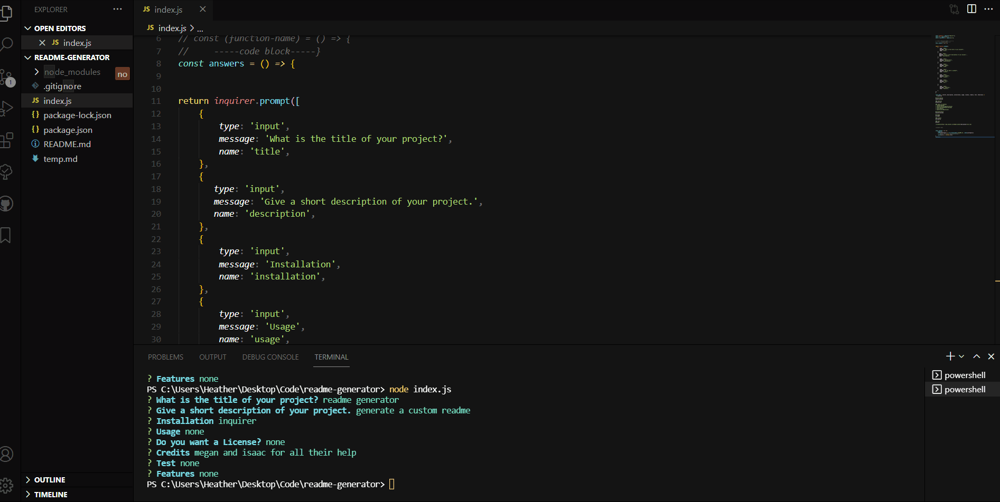

# readme gen

## Description 
generating a readme 

### Features
none

### Table of Contents
* [Usage](#Usage)
* [Installantion](#Installation)
* [Contributing](#Contributing)
* [Test](#Text)
* [Questions](#Questions)

## Installation

npm i for inquirer
=======
To install the necessary depenencies, run the following command npm install or npm i

## Usage
none

### Credits
me

### Test
done

<<<<

=======
### Demo

